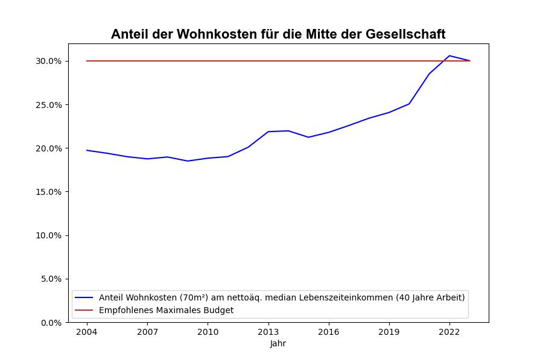

### Wohnen ###

Berechnung enthält keinen Profit für die Vermieter:innen bzw. Wohnungskäufer:innen
(in der Realität müsste der Anteil also noch höher sein).

Alle Preise beziehen sich auf die Marktpreise des jeweiligen Jahres.

Quelle Wohnungspreise:
https://de.statista.com/statistik/daten/studie/554954/umfrage/kaufpreise-fuer-eigentumswohnungen-aller-baujahre-in-deutschland/

Quelle Median Nettoaequivalenzeinkommen:
https://www.wsi.de/de/verteilungsbericht-2022-30037-medianeinkommen-30065.htm
Expandiert mit:
https://www.destatis.de/DE/Themen/Gesellschaft-Umwelt/Einkommen-Konsum-Lebensbedingungen/Lebensbedingungen-Armutsgefaehrdung/Tabellen/einkommensverteilung-mz-silc.html

Quelle Mietnebenkosten:
https://mieterbund.de/service/checks-formulare/betriebskosten/betriebskostenspiegel/
Korrigierter Faktor für 2018 (wegen Änderung der Berechnungsgrundlage):
https://www.vermietet.de/magazin/betriebskostenspiegel/#:~:text=2018%20mussten%20Mieter%20in%20Deutschland,circa%202%2C5%20Prozent%20vor.

Erweitert für 2004 mit:
https://www.berliner-mieterverein.de/magazin/online/mm0106/010610b.htm

Korrigiert für 2021 mit:
https://www.mieterbund-nrw.de/mieterservice/betriebskostenspiegel#:~:text=im%20Jahr%202021%20im%20Durchschnitt,und%20Monat%20f%C3%BCr%20Betriebskosten%20zahlten.